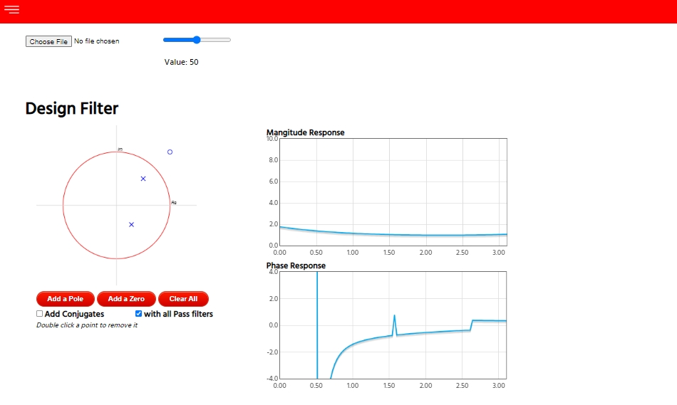

# Digital-Filter-Design

Web app to help you design a custom digital filter (Signal Filtering)

Try Online: https://suhailaahmed.github.io/Digitial-Filter-Design

## Specification

Implement a website that helps users to design a custom digital filter via zeros-poles placement on the z-plane. Your 
website should have the following feature:

* A plot for the z-plane with the unit circle, where the user can place different zeros and poles. The user can also 
make the following modifications:

    * Modify the placed zeros/poles by dragging them,
    * Click on a zero or pole and delete it,
    * Clear all zeros or clear all poles or clear all,
    * Has the option to add conjugates or not for the complex elements.

* A plot that shows the corresponding frequency response for the placed elements: One graph for the magnitude 
response and another graph for the phase response.
Upon finishing the filter design and visualizing the filter response, the user should be able to:

    * Apply the filter on a lengthy signal (minimum of 10,000 points) as if it is a real-time filtering process. A graph
    should show the time progress of the signal (i.e. do not show all the signal on the graph at once), and another
    graph to show the time progress of the filtered signal (i.e. upon applying the difference equation on the points
    one by one). The user should be able to control the speed of the filtering process. For example, the filter can
    process 1 point per second or 100 points per second or any number in between via a slider.

    * Correct for the phase by adding some All-Pass filters. The user can pick the suitable all-pass through a library
    available in your website. This needs the website to have the following features:

        * A library of all-pass filter that the user can visualize (its zero-pole combination as well as its phase
        response), then pick one or more to add to the original design filter.

        * A custom-built all-pass: if the user cannot find a good all-pass in the provided library, then s/he build his
        own. i.e. provide an arbitrary “a” and the website would calculate its phase response and integrate it with its library.

        * The user can enable/disable the added all-pass elements via a drop-menu or checkboxes group.
